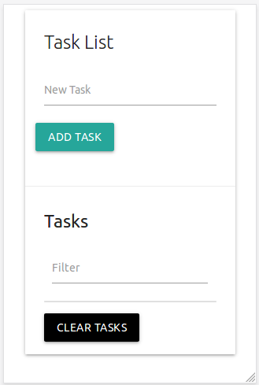

# Task Web page .

### By using HTML & CSS & JS 

## Poject contain: 
- Add your task. 
- Filter tasks.
- Remove it when your done  :shipit:.
- Save your task in local storage :+1: .

## Responsive page. 

## Build by Materil Design.

